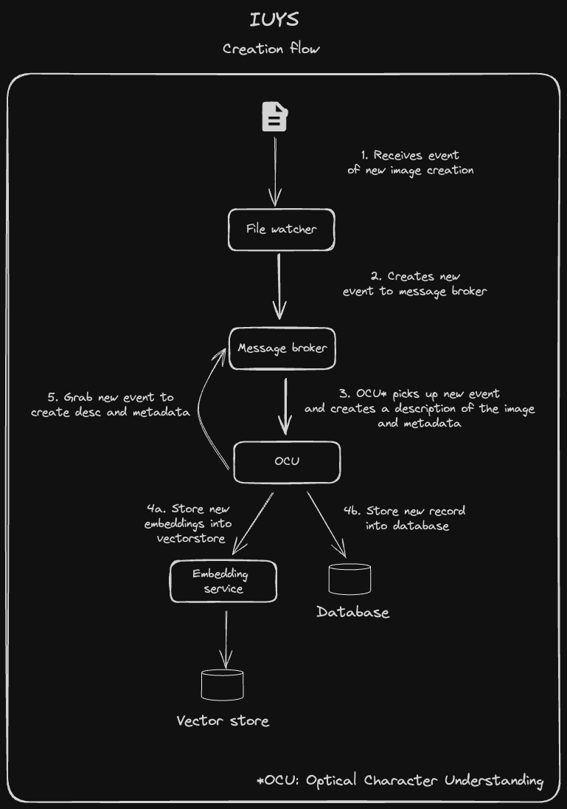

# IUYS (I Understand Your Screenshots)

## About

Inspired by [Sam Witteveen](https://github.com/samwit) during his demonstration in Machine Learning Singapore group meetup.
This is a more "software engineering" take on the idea (if you'll allow me) and also to improve my skills relating to application development and GenAI related matters

## Description

IUYS is a tool that understands your images or screenshots for you to be able perform query and find the relevant results ala "Google Search" style

## Toolings Used

Note: lancedb and dbm in this tool are ephemeral, once we shut the tooling down it loses all context. We retain context by creating a dump file and loading it back when the tool initializes again

- kombu (Event broker)
- Watchdog (File watcher)
- lancedb (Vector store)
- dbm (Key-value store)

## Flows

### Creation Flow

